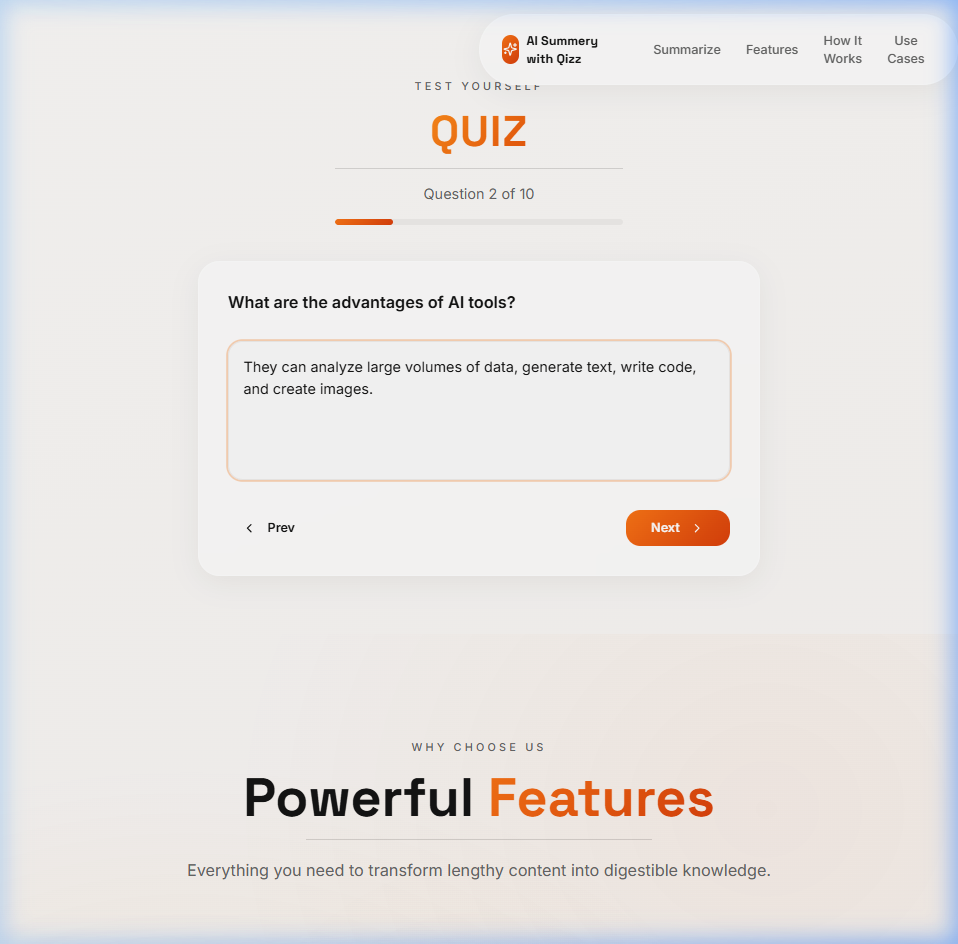

# AI Summarizer with Quiz Generator 🤖📝

A modern, full-stack AI-powered web application that summarizes raw text, uploaded PDF documents, and YouTube videos, and automatically generates interactive 10-question quizzes from the generated summaries to test comprehension.

---

## 🚀 Demo & Screenshots

### Application Preview


### Video Demo
You can view the interactive demo recording showing the text summarization and quiz generation flow in action:
[Watch Demo Video](assets/demo_recording.webp)

---

## ✨ Features

- **Multi-Source Summarization:**
  - **Raw Text:** Paste any text directly.
  - **PDF Documents:** Upload text-based PDF files for instant summaries.
  - **YouTube Videos:** Simply paste a YouTube URL to automatically retrieve the video transcript (via api, watch page, or audio transcription fallback) and summarize it.
- **Interactive Quiz Generator:**
  - Automatically generates a 10-question quiz tailored specifically to the generated summary.
  - Interactive multi-step UI allowing users to answer questions, navigate back and forth, and view final results.
- **Premium User Interface:**
  - Clean, responsive glassmorphism UI built with Tailwind CSS.
  - Smooth micro-animations powered by Framer Motion.
  - Quick-action buttons and clear input validation.

---

## 🛠️ Technology Stack

### Frontend (Modern React SPA)
* **Framework:** React with TypeScript & Vite
* **Styling:** Tailwind CSS & Shadcn UI
* **Animations:** Framer Motion
* **Routing:** React Router

### Backend (Python API Server)
* **Framework:** Flask & Flask-CORS
* **Models / NLP:** Hugging Face `transformers` pipeline
  * **Summarization:** `sshleifer/distilbart-cnn-12-6`
  * **Quiz Generation:** `google/flan-t5-base`
  * **Audio/Video Transcription:** `faster-whisper` (Whisper CPU fallback)
* **Utilities:** `youtube-transcript-api`, `yt-dlp` (for YouTube audio/subtitles), `PyMuPDF` (for PDF parsing)

---

## ⚙️ Local Setup and Installation

Follow these steps to run the application locally on your machine.

### Prerequisites
* **Python 3.8+**
* **Node.js 18+**

### Step 1: Clone the Repository
```bash
git clone https://github.com/YashThombare/Ai-Summarizer-with-quiz.git
cd Ai-Summarizer-with-quiz
```

### Step 2: Set Up the Backend
1. **Create a virtual environment:**
   ```bash
   python -m venv env
   ```
2. **Activate the virtual environment:**
   * **Windows (PowerShell):**
     ```powershell
     .\env\Scripts\Activate.ps1
     ```
   * **macOS/Linux:**
     ```bash
     source env/bin/activate
     ```
3. **Install dependencies:**
   ```bash
   pip install -r requirements.txt
   ```
4. **Run the backend server:**
   ```bash
   python backend/App.py
   ```
   *The Flask API server will start on `http://localhost:5000`.*

### Step 3: Set Up the Frontend (Vite Dev Server)
1. **Navigate to the frontend folder:**
   ```bash
   cd frontend-react
   ```
2. **Install dependencies:**
   ```bash
   npm install
   ```
3. **Run the development server:**
   ```bash
   npm run dev
   ```
   *The development server will open automatically in your browser on `http://localhost:8080`.*

---

## 🚀 Running 24/7 (Windows Scripts)

Two utility scripts are provided to automatically keep the server running and auto-restart it if it crashes:
- `run_server_24_7.bat` (Batch script)
- `run_server_24_7.ps1` (PowerShell script)

To launch the backend server 24/7:
```powershell
./run_server_24_7.ps1
```
